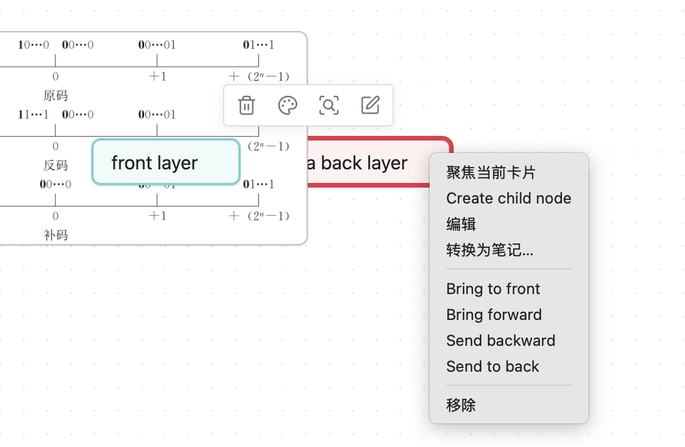

# Canvas Layer Order

Canvas Layer Order adds PowerPoint-style layer controls to Obsidian Canvas, making it easier to work with overlapping cards.



Obsidian Canvas stores cards in the `nodes` array of a `.canvas` JSON file. In overlapping areas, cards that appear later in that array render above cards that appear earlier. This plugin changes layer order by moving the selected card inside that array.

## Features

- Bring a Canvas card to front
- Send a Canvas card to back
- Bring a Canvas card forward by one layer
- Send a Canvas card backward by one layer
- Optional focus behavior that keeps the saved layer order visible when a card is focused

## Usage

- `Canvas: Bring selected card to front`
- `Canvas: Send selected card to back`
- `Canvas: Bring selected card forward`
- `Canvas: Send selected card backward`

These commands can be used from the command palette or assigned to hotkeys.
They are also available from the Canvas card context menu in supported Obsidian versions.

## Focus Behavior

Obsidian may temporarily lift a focused Canvas card above nearby cards. Enable `Preserve layer order when focusing cards` in this plugin's settings to keep the visual stack aligned with the saved Canvas node order.

## Manual Installation

Copy these files into your vault's plugin folder:

```text
<vault>/.obsidian/plugins/canvas-layer-order/
```

Required files:

- `main.js`
- `manifest.json`
- `styles.css`

Then reload Obsidian and enable `Canvas Layer Order` in Community plugins.

## Development

```bash
npm install
npm run dev
```

To create a production build:

```bash
npm run build
```

Release files for Obsidian community plugins:

- `main.js`
- `manifest.json`
- `styles.css`

## Notes

Canvas internals are not part of Obsidian's public plugin API. This plugin keeps those assumptions isolated in a small part of the codebase so future Obsidian changes are easier to adapt to.
